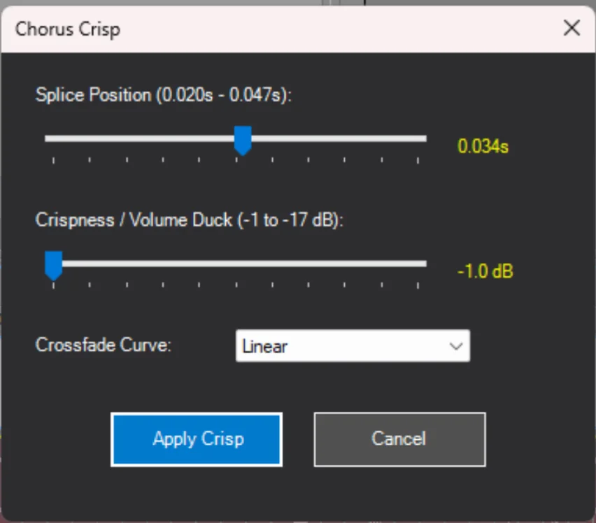

# Chorus Crisp

A Vegas Pro script for creating punchy, layered vocal chop effects commonly used in Sparta Remixes.



## What It Does

Chorus Crisp automates a technique where each audio clip is:
1. **Split** at a tiny offset (20-47ms from the start)
2. **Overlapped** - the second clip is extended backwards to layer with the first
3. **Crossfaded** - smooth transition between the overlapping sections
4. **Ducked** - the second clip's volume is reduced to let the attack punch through

This creates that crispy, doubled vocal effect that's signature to Sparta Remixes.

## Before & After

### Before


### After


Notice how each clip now has an overlapping section with crossfades, and the second portion of each clip shows reduced volume (the percentages like 57.4%, 46.1%, etc.).

## Installation

1. Download `ChorusCrisp.cs`
2. Place it in your Vegas Script Menu folder:
   ```
   C:\Users\[YourName]\Documents\Vegas Script Menu\
   ```
   Or create a subfolder:
   ```
   C:\Users\[YourName]\Documents\Vegas Script Menu\ChorusCrisp\ChorusCrisp.cs
   ```
3. In Vegas Pro, go to **Tools → Scripting → Rescan Script Menu Folder**

## Usage

1. **Select** the audio clips you want to process on the timeline
2. Go to **Tools → Scripting → ChorusCrisp**
3. Adjust the parameters in the dialog:
   - **Splice Position**: Where to cut each clip (0.020s - 0.047s)
   - **Volume Duck**: How much to reduce the second clip's volume (-1 to -17 dB)
   - **Crossfade Curve**: The easing type for the crossfade (Linear, Fast, Slow, Sharp, Smooth)
4. Click **Apply Crisp**

## Parameters

| Parameter | Range | Default | Description |
|-----------|-------|---------|-------------|
| Splice Position | 0.020s - 0.047s | 0.034s | How far into each clip to make the cut. Smaller = tighter attack. |
| Volume Duck | -1 dB to -17 dB | -1.0 dB | How much quieter the second clip should be. More negative = more ducking. |
| Crossfade Curve | Linear, Fast, Slow, Sharp, Smooth | Linear | The shape of the crossfade between clips. |

## How It Works

For each selected audio event, the script:

1. Calls `Split()` at the splice offset to create two events
2. Adjusts the second event's `Take.Offset` and `Start` position to extend it backwards
3. Sets `FadeIn` on the second event and `FadeOut` on the first event
4. Applies volume reduction via `AudioEvent.NormalizeGain` on the second clip only

All operations are wrapped in an `UndoBlock` so you can Ctrl+Z the entire batch.

## License

Free to use and modify. Credit appreciated but not required.

## Credits

Created for the Sparta Remix community.
